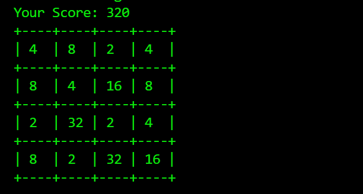

## 2048 Game (Python & NumPy)

A classic 2048 puzzle game implementation in Python, utilizing NumPy for efficient matrix manipulation and custom logic for tile merging.

We need install "keyboard" package using 
"We can mention in requirements.txt file to install the keyboard lib.

To create Array (4 x 4) , I am using numpy lib
"We can mention in requirements.txt file to install the numpy lib.

## To run the 2048 game 
python 2048_Game.py 

After this , if you want to see the helper function , after runnung the code , Press 'h'
letter from key board , It will display the below output to play the game smoothly.

## Helper Function 
    h   : For help
    u   : For undo
    r   : For redo
    s   : For restart
    ↑   : For up swipe
    ↓   : For down swipe
    ←   : For left swipe
    →   : For right swipe
    esc : Exiting

## Features
1. NumPy-Powered Grid: Uses a $4 \times 4$ matrix for high-performance calculations.
2. Undo/Redo System: Made a mistake? Step back in time with the built-in state management.
3. Formatted CLI: A clean, easy-to-read command-line interface with aligned cells.
4. Score Tracking: Real-time calculation of your current score.

## Tech Stack
1. Python 3.x
2. NumPy: Used for grid initialization, row/column rotations, and tile merging.

## How to Play
1. Move Tiles: Use ↑ (Up), ↓ (Down), ← (Left), and → (Right) to slide the tiles.
2. Merge: When two tiles with the same number touch, they merge into one!
3. Undo: Press U to undo your last move if you get into a tight spot.
4. Goal: Reach the 2048 tile to win!

## Run on Windows PowerShell

Create the virtual environment:

```powershell
python -m venv .venv
```

Activate:

```powershell
.venv\Scripts\Activate.ps1 or source .venv/bin/activate
```

Install:

```powershell
pip install -r requirements.txt
```

Start:

```powershell
streamlit run streamlit_app.py
```

Streamlit will show a local URL, normally:

```text
http://localhost:8501
```

## Controls

The web version currently uses Python/Streamlit buttons:

- UP
- DOWN
- LEFT
- RIGHT
- Undo
- Redo
- New Game

The original terminal application remains available through:

```powershell
python 2048_Game.py
```

## Why buttons instead of keyboard arrows?

A browser needs browser-side event handling to capture raw arrow-key events.
This version intentionally contains **no custom JavaScript**, as requested.

Once the Python-only version is verified, we can decide whether to:
1. keep Streamlit buttons, or
2. use a Python/browser framework that supports keyboard events differently.

## Sample Output

